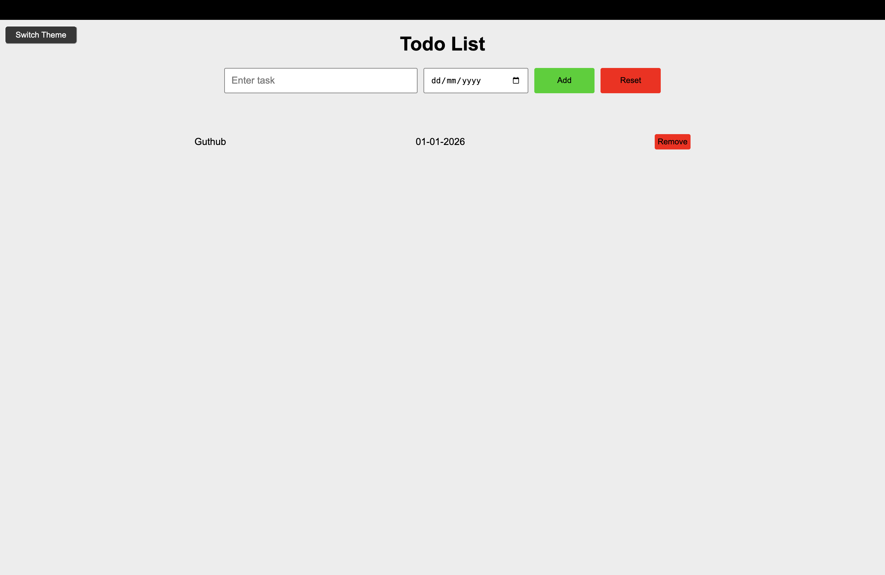
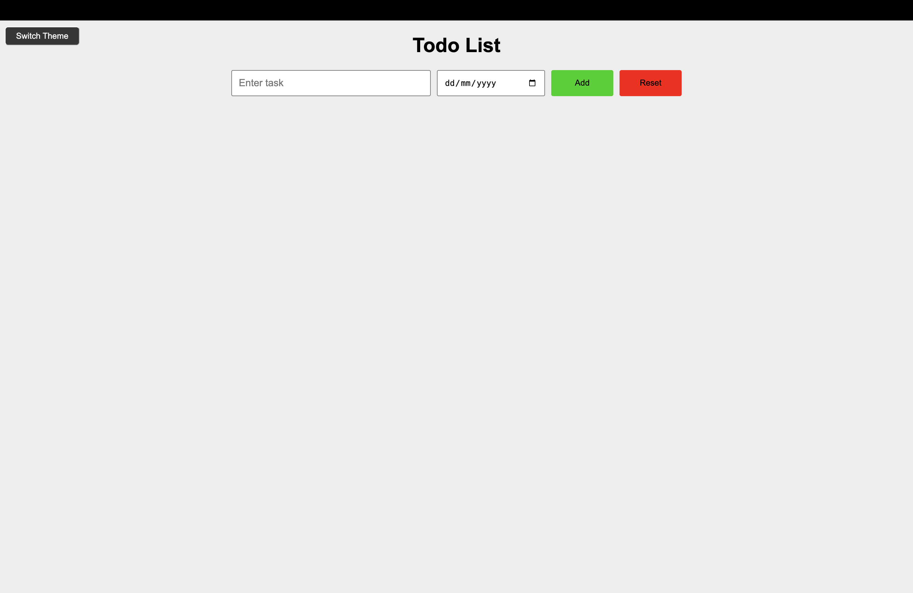
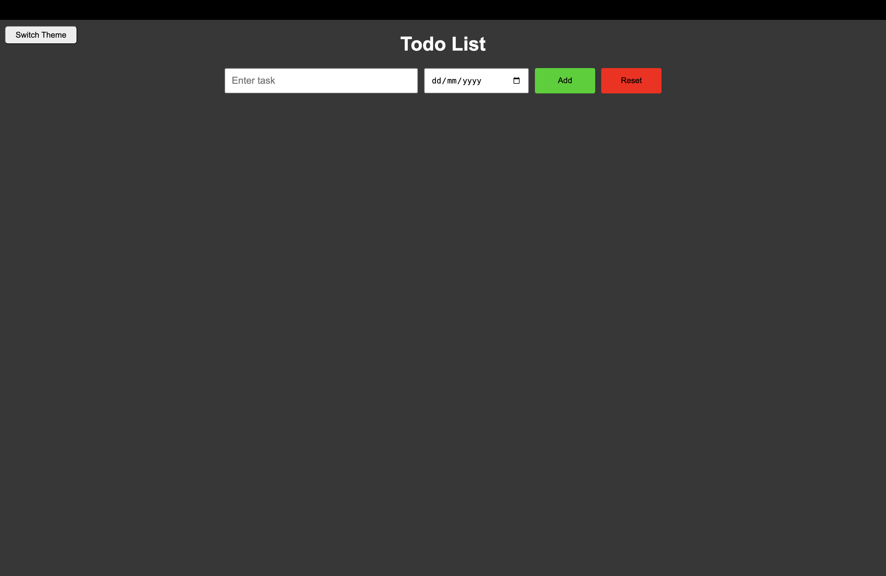

# To-Do List


A simple and interactive **To-Do List application** built using **HTML, CSS, and Vanilla JavaScript**.  
This project allows users to manage daily tasks efficiently by adding, deleting, and resetting tasks. The application also supports **persistent task storage using Browser LocalStorage**, ensuring tasks remain available even after refreshing or reopening the browser.

---

## Live Demo

[View Live Demo](https://mabhishek-dev.github.io/todo-list/)

---

## Tech Stack

- **HTML5**
- **CSS3**
- **JavaScript (Vanilla JS)**
- **Browser LocalStorage**

---

## Features

- Add new tasks  
- Delete individual tasks  
- Reset all tasks  
- Persistent task storage using **Browser LocalStorage**  
- Toggle between **Light Theme** and **Dark Theme**

---

## Purpose

This project was built to strengthen core **JavaScript fundamentals** by implementing dynamic DOM manipulation and browser storage.

Key concepts practiced include:

- Handling user input with JavaScript  
- Dynamically rendering UI elements  
- Managing task data using JavaScript and LocalStorage
- Using **Browser LocalStorage** to persist data  
- Implementing theme toggling functionality  

---

## Project Structure

```
todo-list/
│
├── index.html
│
├── script/
│   ├── index.js
│   └── theme.js
│
├── style/
│   ├── general.css
│   ├── input.css
│   └── render.css
│
└── screenshots/
    ├── demo.png
    ├── light-theme.png
    └── dark-theme.png
```

---

## Setup Instructions

Clone the repository:

```bash
git clone https://github.com/mabhishek-dev/todo-list.git
cd todo-list
```

Then open:

```
index.html
```

in your browser.

No dependencies or build tools are required.

---

## Screenshots

### Demo


### Light Theme


### Dark Theme


---

## License

This project is licensed under the **MIT License**.
